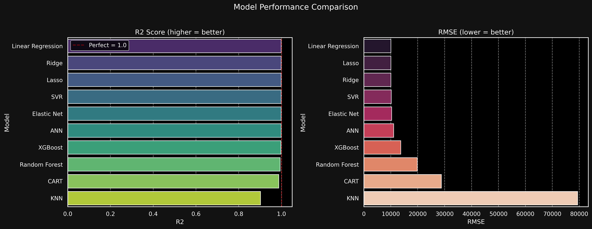
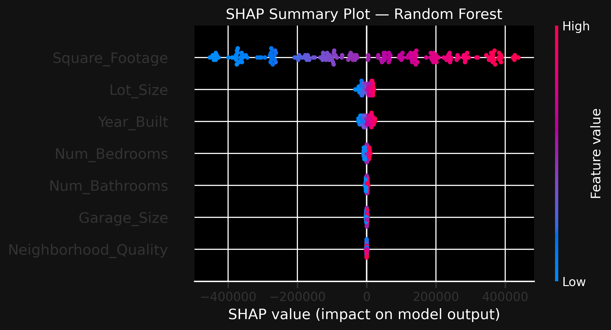
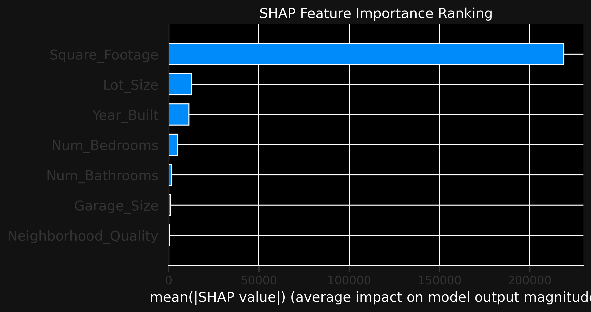
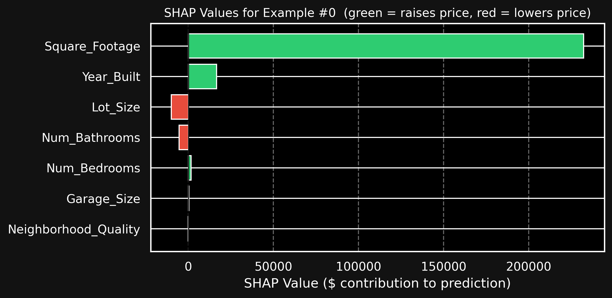

# House Price Prediction

**Dataset:** [Home Value Insights](https://www.kaggle.com/datasets/prokshitha/home-value-insights)

In this project, we predict house prices using a wide range of regression models from linear approaches (Ridge, Lasso, Elastic Net) to tree-based and non-linear methods (Random Forest, XGBoost, KNN, SVR, ANN). The notebook covers the full ML pipeline: exploratory analysis, outlier detection, assumption checks, hyperparameter tuning, cross-validation, SHAP interpretability, and a final model comparison.

---

## 📌 Features

| Feature | Description |
|---|---|
| `Square_Footage` | Living area in square feet (It is generally expected that larger homes will be even more expensive.) |
| `Num_Bedrooms` | Number of bedrooms |
| `Num_Bathrooms` | Number of bathrooms |
| `Year_Built` | Year the house was built (*Older homes may be priced lower due to wear and tear.*) |
| `Lot_Size` | Lot area in square feet(*Larger lots generally increase a home's value*.) |
| `Garage_Size` | Number of cars the garage fits |
| `Neighborhood_Quality` | Neighborhood rating (1–10) |
| **`House_Price`** | **Target variable** (*The dependent variable we will estimate is the price of the house.*) |

## Machine Learning Pipeline
1.  **Exploratory Data Analysis (EDA):** Initial data inspection, distribution analysis, and correlation matrix visualization.
2.  **Outlier Detection:** Identification of outliers using IQR and Isolation Forest methods.
3.  **Data Preparation:** Splitting data into training and testing sets, and feature scaling using `StandardScaler`.
4.  **Model Training & Evaluation:** Implementation and evaluation of various regression models:
    *   Linear Regression (with assumption checks)
    *   Ridge, Lasso, Elastic Net (Regularized Linear Models)
    *   KNeighborsRegressor (KNN)
    *   Support Vector Regressor (SVR)
    *   Artificial Neural Network (ANN)
    *   Decision Tree Regressor (CART)
    *   Random Forest Regressor
    *   XGBoost Regressor
5.  **Hyperparameter Tuning:** `GridSearchCV` is used to find optimal hyperparameters for most models.
6.  **Model Comparison:** Comparison of models based on R², RMSE, MAE, and MAPE metrics.
7.  **Cross-Validation:** Robust performance estimation using 5-Fold Cross-Validation.
8.  **Learning Curves:** Analysis of learning curves to diagnose overfitting/underfitting.
9.  **Advanced Residual Analysis:** Detailed diagnostics for Linear Regression residuals (Q-Q plot, histogram, standardized residuals, residual sequence).
10. **SHAP Interpretability:** Explaining model predictions and feature importance using SHAP values.

## Model Comparison

- The models were evaluated based on the R², RMSE, and MAE metrics. Due to the synthetic data structure, linear models produced near-perfect results. 

| Model | R2 Score | RMSE | MAE | MAPE (%) |
| :--- | :---: | :---: | :---: | :---: |
| **Linear Regression** | **0.9984** | **10071.48** | **8174.58** | **1.66** |
|	Ridge|	0.9984|	10076.22|8180.95|1.67|
|	Lasso|	0.9984|	10072.33|8176.16|1.66|
|	SVR| 0.9984| 10205.91|8333.01|1.69|
|	Elastic Net| 0.9983|10336.38|8464.25|1.73|
|	ANN	|0.9981 | 11098.92|	8823.50	|1.99|
|	XGBoost| 0.9971|13730.55|11422.98|	2.30|
|	Random Forest| 0.9939|19853.32|	16106.27|	3.24|
|	CART|0.9871|28782.61|22785.83|	4.73|
|	KNN| 0.9022	|79397.09|	63771.13|	14.67|

 
##  SHAP Interpretability

SHAP (SHapley Additive exPlanations) was used to explain the model predictions and to understand which features have the greatest impact on price.

 

  
## About the quality of the dataset:  
The dataset is almost certainly synthetic. In real-world real estate data, location and neighborhood quality are among the strongest price drivers yet here their correlation with price is effectively zero. Perfect normal distributions across all features and a near-perfect linear relationship between area and price further support this conclusion.

**Real-world implication:**  
* On genuine housing data, non-linear models (XGBoost, Random Forest) and location-aware features would likely outperform simple linear regression significantly. This project demonstrates the full ML workflow; results should be interpreted in the context of a synthetic dataset.

## Key Findings

**Best model: Linear Regression**
- The ~0.99 correlation between `Square_Footage` and `House_Price` makes this dataset ideal for simple linear regression  the relationship is almost perfectly linear.
- Complex models (Random Forest, XGBoost, ANN) provide no meaningful advantage here; the linear model already achieves near-ceiling performance.
- All four OLS assumptions were verified: normality, no autocorrelation, homoscedasticity, linearity.
- 5-fold cross-validation confirmed that results are stable and not a product of a lucky train/test split.
- SHAP analysis confirmed `Square_Footage` as the overwhelmingly dominant predictor across all individual predictions.
---

## Installation
To run this project locally, clone the repository and install the dependencies:

```bash
git clone [https://github.com/berkw2b/house-price-prediction.git](https://github.com/berkw2b/house-price-prediction.git)
cd house-price-prediction
pip install -r requirements.txt
